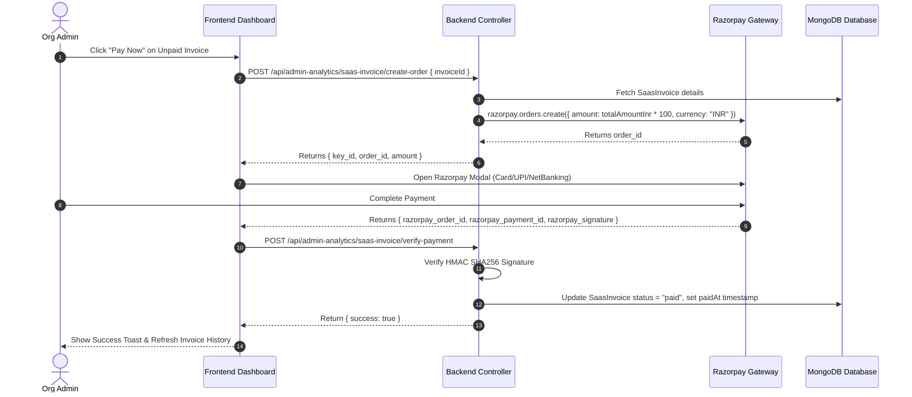

# Classgrid Master Billing & Metering System Blueprint
**Document Location:** `server/docs/billing-research.md`  
**Generated Date:** July 29, 2026  
**Status:** Master Implementation Reference  

---

## 1. Executive Summary & Architecture Overview

Classgrid operates on a hybrid enterprise SaaS billing model:
1. **Module-Based Subscription Model (Fixed Monthly Fee)**: Orgs pay a fixed monthly rate per enabled module (e.g. Admissions, Fees, HR, Library, Canteen, AI Assistant, NAAC Auditor) set dynamically by Super Admin.
2. **Resource Consumption Model (Pay-As-You-Go Ledger)**: Orgs pay for metered resource consumption accrued daily (Cloudflare R2 storage, AWS SES emails, AWS SNS SMS segments, OpenAI/Groq/Gemini AI tokens, Agora live video minutes, and EC2/Vercel API calls).
3. **Dashboards**: The base platform fee includes 3 standard dashboards (Student, Faculty, Org Admin). Dashboards 4–10 are optional add-on dashboards configured per tenant.
4. **Tax & Invoicing**: Invoices are generated automatically on the 1st of every month at 06:00 AM IST by a background worker, incorporating fixed module fees, metered daily usage, and mandatory **18% GST**.

---

## 2. Phase 1: Comprehensive Codebase Audit

### 2.1 Backend File Audit & Line-by-Line Technical Analysis

#### 1. [OrgSubscription.js](file:///c:/CLASSGRIDPLATFORM/classgrid_platoform-desktop-/server/src/models/OrgSubscription.js)
- **Path**: `server/src/models/OrgSubscription.js` (78 lines)
- **Current Schema**:
  - `plan`: Enum `['sandbox', 'demo', 'active']`, default `'demo'`.
  - `status`: Enum `['active', 'expired', 'cancelled', 'grace_period']`.
  - `features`: Boolean flags for `attendance`, `examinations`, `admissions`, `canteen`, `ai_viva`, `naac_auditor`.
  - `metadata`: Limits for `max_students`, `max_faculty`, `max_dept_admins`, `storage_limit_gb`.
  - `billing` object: Contains numeric fields `basePricePerMonth`, `pricePerStudent`, `pricePerGB`, `pricePerEmail`, `pricePerSms`, `pricePerApiRequest`, `pricePerAiToken`, `pricePerAgoraMinute`, `pricePerFaculty`, `pricePerDeptAdmin`.
- **Gaps Identified**: Lacks dynamic per-module monthly price fields (`modulePrices` map or schema object) to charge per enabled module.

#### 2. [Organization.js](file:///c:/CLASSGRIDPLATFORM/classgrid_platoform-desktop-/server/src/models/Organization.js)
- **Path**: `server/src/models/Organization.js` (579 lines)
- **Current Schema**:
  - `billing_settings`: Object containing `invoice_email`, `state`, `address` (Lines 110-114).
  - `feature_flags`: Contains 23 boolean flags (Lines 497-525) including `erp_core`, `naac_module`, `hr_module`, `marketplace_module`, `admission_module`, `canteen_module`, `exam_proctoring`, `custom_domain_module`, `fee_module`, `ai_assistant`, `analytics_module`, `website_module`, `certificates_module`, `events_module`, `feedback_module`, `holiday_module`, `id_cards_module`, and dashboard flags (`dashboard_admission`, `dashboard_fees`, `dashboard_exam`, `dashboard_library`, `dashboard_attendance`, `dashboard_hr`, `dashboard_hostel`).
- **Gaps Identified**: 15 marketing website modules are missing corresponding feature flag keys in the model schema (e.g. `timetable_module`, `quiz_module`, `viva_module`, `alumni_module`, `canteen_dashboard`).

#### 3. [OrganizationUsageDaily.js](file:///c:/CLASSGRIDPLATFORM/classgrid_platoform-desktop-/server/src/models/OrganizationUsageDaily.js)
- **Path**: `server/src/models/OrganizationUsageDaily.js` (171 lines)
- **Current Schema**: Immutable ledger model storing daily usage snapshots.
  - `lineItems`: Array of usage items with `provider`, `resourceKey`, `resourceLabel`, `quantity`, `unit`, `unitRateInr`, `amountInr`, `source`, `metadata`.
  - `totals`: Aggregated totals for `storageGbDays`, `emails`, `sms`, `amountInr`.
  - Enforces immutability via Mongoose `pre` hooks blocking `updateOne`, `updateMany`, `deleteOne`, etc. (Lines 161-167).

#### 4. [SaasInvoice.js](file:///c:/CLASSGRIDPLATFORM/classgrid_platoform-desktop-/server/src/models/SaasInvoice.js)
- **Path**: `server/src/models/SaasInvoice.js` (131 lines)
- **Current Schema**: Stores generated monthly SaaS invoices.
  - `billingPeriod`: `month`, `year`, `startDate`, `endDate`.
  - `lineItems`: Array of line items (`provider`, `resourceLabel`, `totalQuantity`, `unit`, `unitRateInr`, `amountInr`).
  - `subtotalInr`, `taxPercent` (default 18), `taxAmountInr`, `totalAmountInr`.
  - `status`: Enum `['draft', 'sent', 'paid', 'overdue', 'cancelled']`.
  - `razorpay`: Payment tracking (`orderId`, `paymentId`, `paymentMethod`, `paidAt`).

#### 5. [organization-usage-metering.service.js](file:///c:/CLASSGRIDPLATFORM/classgrid_platoform-desktop-/server/src/services/organization-usage-metering.service.js)
- **Path**: `server/src/services/organization-usage-metering.service.js` (564 lines)
- **Current Logic**:
  - `calculateR2UsageByOrg`: Scans R2 bucket via `ListObjectsV2Command` and assigns object sizes to orgs based on key patterns.
  - `calculateEmailUsageByOrg`: Aggregates `EmailJob` documents with status `"sent"`.
  - `calculateSmsUsageByOrg`: Aggregates `SmsLog` documents with status `"sent"` or `"delivered"`.
  - `calculateApiRequestsByOrg`: Aggregates `ApiMetricBucket` metrics.
  - `calculateAiTokensByOrg`: Aggregates `AiUsageLog` entries by provider (`openai`, `groq`, `gemini`).
  - `calculateAgoraMinutesByOrg`: Aggregates `GoLive` session `watchTimeMinutes`.

#### 6. [monthly-invoice.worker.js](file:///c:/CLASSGRIDPLATFORM/classgrid_platoform-desktop-/server/src/workers/monthly-invoice.worker.js)
- **Path**: `server/src/workers/monthly-invoice.worker.js` (257 lines)
- **Current Logic**: Runs on cron `"0 6 1 * *"` (1st of month at 06:00 AM IST).
  - Fetches all `OrganizationUsageDaily` records for the previous month.
  - Groups records by `organizationId`.
  - Aggregates daily resource consumption into invoice line items.
  - Adds `basePricePerMonth` platform fee if > 0.
  - Computes subtotal, applies 18% GST (`taxAmountInr`), saves `SaasInvoice`.
  - Dispatches invoice notification email via `EmailJob`.
- **Gaps Identified**: Does not currently iterate through `Organization.feature_flags` to add line items for enabled modules.

#### 7. [org-configuration.controller.js](file:///c:/CLASSGRIDPLATFORM/classgrid_platoform-desktop-/server/src/controllers/org-configuration.controller.js)
- **Path**: `server/src/controllers/org-configuration.controller.js` (210 lines)
- **Current Endpoints**:
  - `getMyOrganizationConfig`: Fetches feature flags and billing rates for Org Admin.
  - `getOrganizationUsageSummary`: Returns live usage counters + daily ledger series.
  - `getOrganizationBilling`: Returns billing rates, current month accrued charges breakdown, past invoices, and billing settings.
  - `updateBillingSettings`: Updates `billing_settings` (`invoice_email`, `state`, `address`).
  - `setupBillingMandate`: Creates a ₹1 Razorpay order for payment method verification.

#### 8. [admin-analytics.controller.js](file:///c:/CLASSGRIDPLATFORM/classgrid_platoform-desktop-/server/src/controllers/admin-analytics.controller.js)
- **Path**: `server/src/controllers/admin-analytics.controller.js` (868 lines)
- **Current Endpoints**:
  - `getOrgAdminBillingDashboard` (Lines 699-795): Fetches billing ledger and daily series for Org Admin.
  - `createSaasInvoiceOrder` (Lines 799-827): Creates Razorpay order for a `SaasInvoice`.
  - `verifySaasInvoicePayment` (Lines 829-867): Verifies Razorpay HMAC signature (`razorpay_order_id|razorpay_payment_id`) and updates `SaasInvoice.status = 'paid'`.

#### 9. [organization.routes.js](file:///c:/CLASSGRIDPLATFORM/classgrid_platoform-desktop-/server/src/routes/organization.routes.js)
- **Path**: `server/src/routes/organization.routes.js` (187 lines)
- Mounts `/my-config`, `/usage`, `/billing`, `/billing/settings`, `/billing/setup-mandate` for `org_admin`.

#### 10. [roles.js](file:///c:/CLASSGRIDPLATFORM/classgrid_platoform-desktop-/server/src/utils/roles.js)
- **Path**: `server/src/utils/roles.js` (216 lines)
- Contains master role definitions and department admin roles (`DEPT_ADMIN_ROLES`).

---

### 2.2 Frontend Audit & File Analysis

1. **[BillingPage.tsx](file:///c:/CLASSGRIDPLATFORM/classgrid_platoform-desktop-/client/src/features/org-admin/pages/BillingPage.tsx)** (806 lines): Built using Tailwind CSS, Recharts, and shadcn UI components. Implements daily cost trend chart, resource pie chart, accrued charge breakdown, invoice history table, invoice details modal, and Razorpay checkout integration.
2. **[UsagePage.tsx](file:///c:/CLASSGRIDPLATFORM/classgrid_platoform-desktop-/client/src/features/org-admin/pages/UsagePage.tsx)** (245 lines): Currently relies on `@tremor/react` components (`Card`, `Metric`, `BarChart`, `Grid`). **Must be completely rebuilt using Tailwind CSS + Recharts + shadcn UI components.**
3. **[orgAdminBillingApi.ts](file:///c:/CLASSGRIDPLATFORM/classgrid_platoform-desktop-/client/src/features/org-admin/services/orgAdminBillingApi.ts)** (111 lines): API interface layer for billing & usage data.
4. **[useOrgAdminBilling.ts](file:///c:/CLASSGRIDPLATFORM/classgrid_platoform-desktop-/client/src/features/org-admin/queries/useOrgAdminBilling.ts)** (17 lines): React Query hooks for fetching billing & usage summaries.
5. **[usePayInvoice.ts](file:///c:/CLASSGRIDPLATFORM/classgrid_platoform-desktop-/client/src/features/org-admin/queries/usePayInvoice.ts)** (49 lines): React Query mutation for Razorpay payment execution and verification.
6. **[SandboxProvisioningWizard.tsx](file:///c:/CLASSGRIDPLATFORM/classgrid_platoform-desktop-/client/src/features/superadmin/components/SandboxProvisioningWizard.tsx)** (305 lines): Wizard where Super Admin configures org features, dashboards, and provisioning.

---

### 2.3 SMS Service & Fast2SMS Purge Verification

A full codebase search for `fast2sms` and `FAST2SMS` returned **0 references**.  
The SMS subsystem has already been migrated to **AWS SNS**:
- `server/src/services/sms.service.js` uses `@aws-sdk/client-sns` (`PublishCommand`) for sending SMS in E.164 format (`+91...`).
- `server/src/services/admissions/admission-notification.service.js` imports `sendSMS` from `sms.service.js` for admission event alerts.

---

## 3. Phase 2: Service Pricing & Module Mapping Matrix

### 3.1 Real-World Third-Party Costs vs. Classgrid Markup

| Service | Provider Metric | Real-World Cost (USD / INR) | Classgrid Retail Rate | Gross Margin % |
| :--- | :--- | :--- | :--- | :--- |
| **AWS SES** | 1 Email Sent | $0.10 / 1,000 emails (₹0.0084/email) | ₹0.05 / email | 83.2% |
| **Cloudflare R2** | 1 GB Storage / Month | $0.015 / GB / month (₹1.25/GB) | ₹5.00 / GB / month | 75.0% |
| **Agora Video** | 1 Participant-Minute | $3.99 / 1,000 mins (₹0.33/min) | ₹0.75 / minute | 56.0% |
| **OpenAI (GPT-4o-mini)**| 1,000 Tokens | $0.0003 / 1K tokens (₹0.025/1K) | ₹0.10 / 1K tokens | 75.0% |
| **Groq (Llama 3.3)** | 1,000 Tokens | $0.0007 / 1K tokens (₹0.058/1K) | ₹0.15 / 1K tokens | 61.3% |
| **Google Gemini Flash**| 1,000 Tokens | $0.0002 / 1K tokens (₹0.016/1K) | ₹0.05 / 1K tokens | 68.0% |
| **AWS SNS SMS** | 1 SMS Segment (India) | ₹0.18 - ₹0.22 / segment | ₹0.35 / segment | 42.8% |
| **Vercel Pro** | Base Infrastructure | $20 - $60 / month fixed | Covered in Platform Base | N/A |
| **Supabase Pro** | Database & Storage | $25 / month fixed | Covered in Platform Base | N/A |
| **MongoDB Atlas** | Database Cluster | $57 - $200 / month fixed | Covered in Platform Base | N/A |
| **Redis** | In-Memory Cache | $10 - $20 / month fixed | Covered in Platform Base | N/A |
| **Firebase FCM** | Push Notifications | FREE | FREE | 100% |

---

### 3.2 Master Module & Feature Flag Mapping Matrix (45+ Modules)

| Category | Module Name | Feature Flag Key | Default Monthly Price (INR) |
| :--- | :--- | :--- | :--- |
| **Core Base** | Core Platform (Base 3 Dashboards) | `erp_core` | Included in Base Platform Fee |
| **Academic** | Attendance System | `attendance_module` | ₹1,500 / month |
| **Academic** | Digital Classroom Management | `classroom_module` | ₹1,000 / month |
| **Academic** | Automated Timetable Generator | `timetable_module` | ₹1,200 / month |
| **Academic** | Academic Planning Tools | `academic_planner_module` | ₹1,000 / month |
| **Academic** | Homework & Assignment System | `assignment_module` | ₹800 / month |
| **Academic** | Student Notes Sharing & Marketplace| `marketplace_module` | ₹1,500 / month |
| **Academic** | Teacher Planner | `teacher_planner_module` | ₹800 / month |
| **Academic** | Subject Management | `subject_management_module` | Included in Core |
| **Academic** | Course Management | `course_management_module` | Included in Core |
| **Assessment**| Online Exam Platform | `exam_module` | ₹2,500 / month |
| **Assessment**| Examination Management | `exam_management_module` | ₹2,000 / month |
| **Assessment**| Interactive Quiz Systems | `quiz_module` | ₹1,200 / month |
| **Assessment**| Grade Entry & Results | `grade_entry_module` | ₹1,000 / month |
| **Assessment**| Internal Assessment Tools | `internal_assessment_module` | ₹1,000 / month |
| **Assessment**| CET/JEE/NEET Exam Conduction | `cet_exam_module` | ₹3,500 / month |
| **Assessment**| Past Paper & Mock Tests | `mock_tests_module` | ₹1,500 / month |
| **Assessment**| AI-Powered Viva | `ai_viva_module` | ₹3,000 / month |
| **Assessment**| Test Series Management | `test_series_module` | ₹2,000 / month |
| **Management**| Admission Engine Portal | `admission_module` | ₹3,000 / month |
| **Management**| Fee Collection System | `fee_module` | ₹3,000 / month |
| **Management**| Staff Leave & Payroll (HR) | `hr_module` | ₹2,500 / month |
| **Management**| Canteen Management System | `canteen_module` | ₹2,000 / month |
| **Management**| Digital Library Management | `library_module` | ₹1,500 / month |
| **Management**| Alumni Network & Portal | `alumni_module` | ₹1,500 / month |
| **Advanced**  | AI Assistant Engine | `ai_assistant` | ₹3,500 / month |
| **Advanced**  | Advanced Analytics | `analytics_module` | ₹2,500 / month |
| **Advanced**  | Compliance & NAAC/NBA Auditor | `naac_module` | ₹4,000 / month |
| **Advanced**  | Digital Certificates | `certificates_module` | ₹1,200 / month |
| **Advanced**  | Holiday Management | `holiday_module` | ₹500 / month |
| **Advanced**  | Digital ID Cards | `id_cards_module` | ₹1,000 / month |
| **Advanced**  | Events Management | `events_module` | ₹1,000 / month |
| **Advanced**  | Feedback System | `feedback_module` | ₹800 / month |
| **Advanced**  | Institution Website Builder | `website_module` | ₹2,000 / month |
| **Dashboard** | Admission Management Dashboard | `dashboard_admission` | ₹800 / month |
| **Dashboard** | Fee Management Dashboard | `dashboard_fees` | ₹800 / month |
| **Dashboard** | Library Management Dashboard | `dashboard_library` | ₹500 / month |
| **Dashboard** | Student Management Dashboard | `dashboard_student` | Included in Core |
| **Dashboard** | Faculty Management Dashboard | `dashboard_faculty` | Included in Core |
| **Dashboard** | Organization Management Dashboard | `dashboard_organization` | Included in Core |
| **Dashboard** | Canteen Management Dashboard | `dashboard_canteen` | ₹500 / month |
| **Dashboard** | Leave & HR Management Dashboard | `dashboard_hr` | ₹800 / month |

---

### 3.3 Master Invoice Calculation Formula

$$\text{Subtotal} = \text{BasePlatformFee} + \sum_{m \in \text{EnabledModules}} \text{Price}(m) + \sum_{r \in \text{Resources}} (\text{Quantity}_r \times \text{Rate}_r)$$

$$\text{GST Amount} = \text{Subtotal} \times 0.18$$

$$\text{Total Invoice Amount} = \text{Subtotal} + \text{GST Amount}$$

---

## 4. Phase 3: 8-Stage Step-by-Step Build Plan

### Stage 1: Backend Schema Enhancements

#### Model Updates: `OrgSubscription.js`
Add `modulePrices` map to store custom monthly pricing per module override configured by Super Admin:
```javascript
modulePrices: {
  type: Map,
  of: Number,
  default: {}
}
```

#### Model Updates: `Organization.js`
Ensure all 45+ feature flags are declared inside `feature_flags` with boolean defaults.

---

### Stage 2: Controller & API Endpoint Updates

Modify `server/src/controllers/org-configuration.controller.js`:
- Update `FLAG_FIELDS` array to include all 45+ feature flag keys.
- Update `getOrganizationBilling` to calculate accrued module charges based on `organization.feature_flags` and `subscription.modulePrices`.

---

### Stage 3: Nightly Metering Worker Updates

Update `server/src/services/organization-usage-metering.service.js`:
- Record daily snapshot of active feature flags into metadata for precise audit logs.

---

### Stage 4: Monthly Invoice Generator Worker Updates

Update `server/src/workers/monthly-invoice.worker.js`:
- Iterate over enabled feature flags in `Organization.feature_flags`.
- Add line items for each active module using `modulePrices` or default pricing table.
- Calculate subtotal, apply 18% GST, create `SaasInvoice` record, and dispatch invoice email.

---

### Stage 5: AWS SNS Migration Verification & Maintenance

- Maintain `server/src/services/sms.service.js` using `@aws-sdk/client-sns`.
- Ensure environment variables `AWS_SNS_ACCESS_KEY_ID`, `AWS_SNS_SECRET_ACCESS_KEY`, and `AWS_SNS_REGION` (`ap-south-1`) are set in production `.env`.

---

### Stage 6: Frontend Billing Page (`/org/admin/billing`)

Rebuild UI using Tailwind CSS + Recharts + shadcn UI components:
1. **Billing Account Card**: Managed Razorpay mandate integration.
2. **Billing Address Card**: Address lines, city, state dropdown, PIN code, GSTIN.
3. **Billing Contact Card**: Invoice email verification.
4. **Accrued Charges Card**: Itemized breakdown of enabled modules + metered usage + 18% GST.
5. **Invoice History Table**: Downloadable invoice drawer and "Pay Now" Razorpay modal trigger.

---

### Stage 7: Frontend Usage Page Rebuild (`/org/admin/usage`)

Rebuild `UsagePage.tsx` without `@tremor/react`:
- Replace Tremor `Card`, `Metric`, `BarChart`, `Grid` with custom Tailwind card components and Recharts `BarChart` / `AreaChart`.
- Display top resource metrics: Emails, SMS, Storage, Live Class Minutes, AI Tokens.
- Display daily usage trend bar chart with month selector dropdown.
- Display student department breakdown and staff role breakdown tables.

---

### Stage 8: End-to-End Razorpay Payment Flow



---

## 5. Verification & Testing Checklist

- [ ] **Schema Integrity**: Verify `OrgSubscription` and `Organization` models load clean without Mongoose validation errors.
- [ ] **Metering Worker**: Run manual trigger of `calculateOrganizationUsageDaily()` and verify line items populate in `OrganizationUsageDaily`.
- [ ] **Invoice Worker**: Run manual trigger of `generateMonthlyInvoices()` and verify `SaasInvoice` generated with GST and module line items.
- [ ] **SMS Service**: Send test OTP using `sendOTP("+919999999999")` via AWS SNS.
- [ ] **Frontend Pages**: Verify `/org/admin/billing` and `/org/admin/usage` render cleanly without Tremor console warnings or broken layouts.
- [ ] **Payment Verification**: Verify Razorpay checkout modal launches and successfully verifies signatures on callback.
